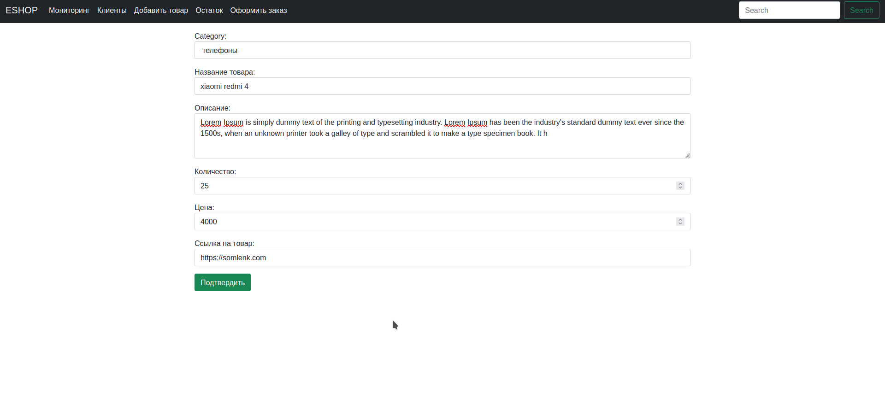
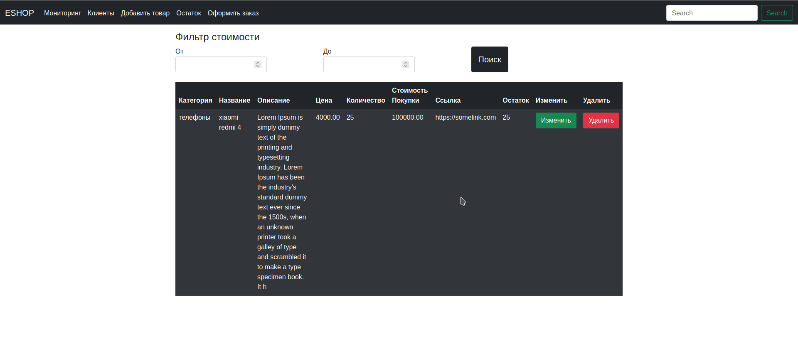
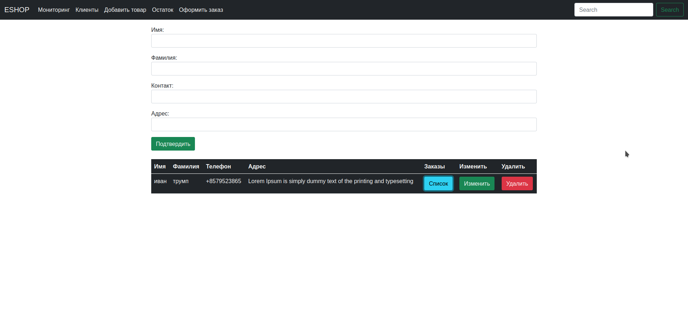

Репозиторий eshop 





### Выполнить последовательно команды в терминале 

1. Клонирование репозитория 
```
git clone https://github.com/Timenem/enshop.git
```
2. Создание вирутального окружения 
```
virtualenv env 
```
3. Активировать виртуальное окружение 
```
source env/bin/activate
```
4. Установка зависимостей 
```
pip install -r requirements.txt
```
5. Создание полей в бд
```
python manage.py makemigrations
python manage.py migrate --run-syncdb
```
6. Запуск приложения 
```
python manage.py runserver
```
